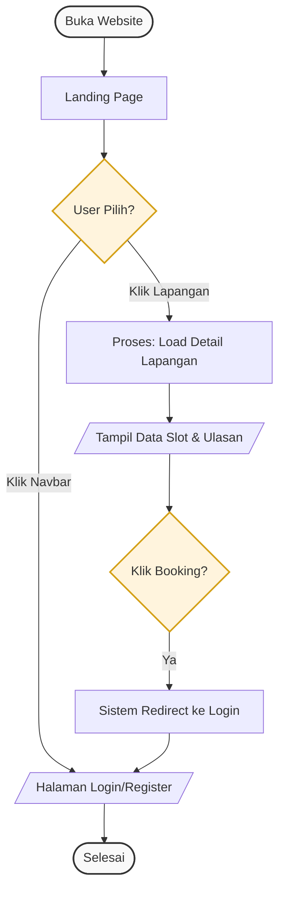
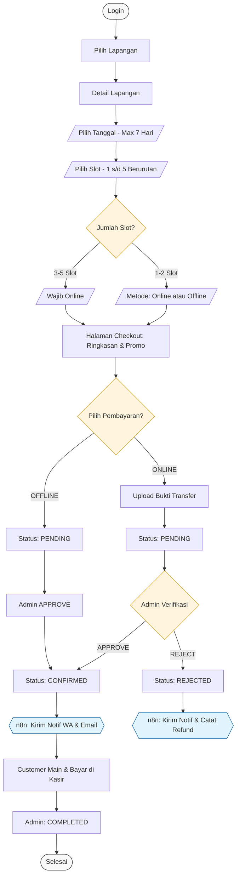
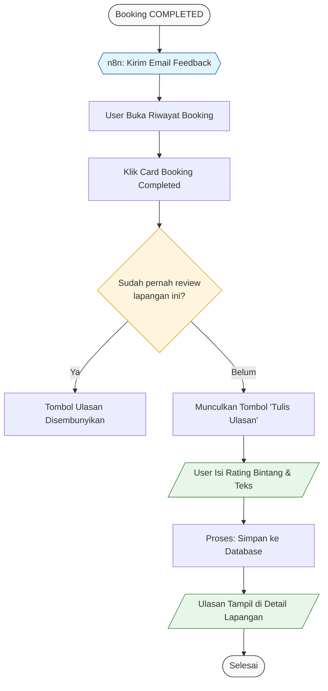
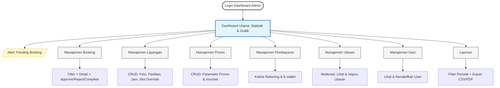

# FutHub Ball · Website Booking Lapangan Futsal
### Latar Belakang
Pengelolaan reservasi lapangan futsal yang masih dilakukan secara manual — via pesan WhatsApp, telepon, atau pencatatan buku — menimbulkan berbagai masalah: jadwal bentrok, ghost booking (booking palsu), dan kesulitan memantau pendapatan secara real-time.
### Tujuan Utama
- Menghilangkan potensi double booking melalui sistem slot otomatis
- Mencegah ghost booking dengan mewajibkan akun & konfirmasi pembayaran
- Memberikan transparansi jadwal kepada pelanggan tanpa perlu login
- Mempermudah admin mengelola lapangan, booking, dan laporan dari satu tempat

---

## Requirements
### Fungsional
- Sistem slot waktu otomatis (24 slot/hari per lapangan) berbasis jam operasional yang dapat dikonfigurasi admin
- Tiga role pengguna dengan hak akses berbeda: Guest, User, Admin
- Dua metode pembayaran: Online (upload bukti transfer) dan Offline (bayar di tempat)
- Sistem promo/diskon yang dapat dikonfigurasi penuh oleh admin
- Sistem ulasan & komentar threaded dengan voting ▲/▼
- Notifikasi otomatis via WhatsApp & Email menggunakan n8n

### Non-Fungsional
- **Aksesibilitas:** Responsif di desktop dan mobile (web browser)
- **Keamanan:** Autentikasi JWT, password di-hash bcrypt, proteksi route per role
- **Konsistensi Data:** Slot di-generate dinamis oleh backend — tidak ada slot yang disimpan statis di database
- **Skalabilitas:** Dirancang untuk 5 lapangan, arsitektur mendukung penambahan lapangan di masa depan

### Batasan Teknis
- Tidak menggunakan payment gateway otomatis (Midtrans/Xendit) — konfirmasi manual oleh admin
- Tidak ada aplikasi mobile native (Android/iOS)
- Tidak mendukung multi-tenant (hanya untuk 1 tempat futsal)
- Tidak ada sistem refund otomatis — diproses manual oleh admin


---
## Aturan Bisnis
### Sistem Slot
- Setiap lapangan memiliki **24 slot/hari** (00:00–01:00 hingga 23:00–24:00)
- Jam operasional **default: 07:00–22:00** — slot di luar jam ini otomatis berstatus `closed`
- Admin dapat **override jam operasional** per hari, hingga 7 hari ke depan
- Slot di-**generate dinamis** oleh backend — tidak disimpan sebagai baris di database
- Booking **1–2 slot**: bisa Online atau Offline
- Booking **3–5 slot**: wajib Online
- Slot yang dipilih harus **berurutan** (tidak boleh loncat)
- Booking lebih dari 5 slot: **dinegosiasikan langsung dengan admin via WhatsApp**

### Status Slot
| Status | Artinya | Diset Oleh |
|---|---|---|
| `available` | Bisa dipesan | Sistem otomatis |
| `closed` | Di luar jam operasional | Sistem otomatis |
| `maintenance` | Ditutup sementara oleh admin | Admin |

### Status Booking
| Status | Artinya | Trigger |
|---|---|---|
| `pending` | Menunggu konfirmasi admin | Sistem saat booking dibuat |
| `confirmed` | Booking dikonfirmasi | Admin approve |
| `rejected` | Booking ditolak | Admin reject |
| `cancelled` | Dibatalkan customer | Via WhatsApp admin |
| `completed` | Selesai dipakai | Admin tandai selesai |

### Pembayaran
- **Online:** Upload bukti transfer → Admin verifikasi → Approve/Reject
- **Offline:** Admin approve → Customer datang & main → Bayar di kasir → Admin tandai `completed`
- Jika booking online di-reject → Admin proses refund manual & catat di sistem (`refund_noted: true`)
- **1 booking = maksimal 1 kode promo** (tidak bisa stack)

### Kode Promo
- Tipe diskon: **persentase (%)** atau **nominal flat (Rp)**
- Bisa berlaku untuk: **semua lapangan** atau **lapangan tertentu**
- Parameter yang dikonfigurasi admin: tanggal mulai, tanggal expired, batas total pakai, batas pakai per user

### Ulasan & Rating
- Hanya user dengan booking `completed` di lapangan tersebut yang bisa menulis ulasan
- **1 user = 1 ulasan per lapangan**
- Sistem komentar **2 level** — level 3+ menggunakan @mention di dalam reply level 2
- Voting **▲/▼** berlaku di ulasan utama dan reply
- Akun yang dihapus → nama tampil sebagai **"Pengguna Dihapus"**, konten tetap ada

### Logika Reminder n8n
```
Saat booking CONFIRMED → sistem cek jarak waktu ke slot:

Jarak > 24 jam   →  Kirim reminder H-1 (jam 08.00 pagi)
                 +  Kirim reminder 2 jam sebelum slot

Jarak 3–24 jam   →  Skip reminder H-1
                 +  Kirim reminder 2 jam sebelum slot

Jarak < 3 jam    →  Tidak ada reminder
```

---

## User Flow
Flow akan berubah tergantung implementasi jadi dari website, jadi ini hanya gambaran kasar (sementara).
### Guest Flow





### User Flow — Booking


### User Flow — Ulasan


### Admin Flow


---

This is a [Next.js](https://nextjs.org) project bootstrapped with [`create-next-app`](https://nextjs.org/docs/app/api-reference/cli/create-next-app).

## Getting Started

First, run the development server:

```bash
npm run dev
# or
yarn dev
# or
pnpm dev
# or
bun dev
```

Open [http://localhost:3000](http://localhost:3000) with your browser to see the result.

You can start editing the page by modifying `app/page.tsx`. The page auto-updates as you edit the file.

This project uses [`next/font`](https://nextjs.org/docs/app/building-your-application/optimizing/fonts) to automatically optimize and load [Geist](https://vercel.com/font), a new font family for Vercel.

## Learn More

To learn more about Next.js, take a look at the following resources:

- [Next.js Documentation](https://nextjs.org/docs) - learn about Next.js features and API.
- [Learn Next.js](https://nextjs.org/learn) - an interactive Next.js tutorial.

You can check out [the Next.js GitHub repository](https://github.com/vercel/next.js) - your feedback and contributions are welcome!

## Deploy on Vercel

The easiest way to deploy your Next.js app is to use the [Vercel Platform](https://vercel.com/new?utm_medium=default-template&filter=next.js&utm_source=create-next-app&utm_campaign=create-next-app-readme) from the creators of Next.js.

Check out our [Next.js deployment documentation](https://nextjs.org/docs/app/building-your-application/deploying) for more details.
